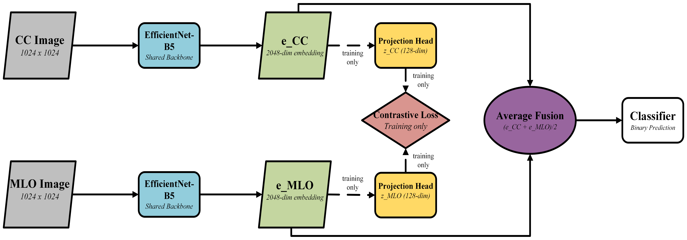

# vindr-mammo-dual-view-classification
Official code and reproducibility materials for dual-view mammogram classification on VinDr-Mammo using CC–MLO fusion.
# Reproducible Multi-View Mammogram Classification on VinDr-Mammo

This repository contains the code for the paper:

**"A Reproducible Multi-View Mammogram Classification Baseline Using Dual-View Fusion on VinDr-Mammo"**

*Jitendra Sai Kota, Saddam Hossain Irfan, Muhammad Imran* *Kennesaw State University*

------------------------------------------------------------------------

## Overview



We present a reproducible baseline for breast-level BI-RADS binary classification on the VinDr-Mammo dataset. A Siamese EfficientNet-B5 backbone encodes paired CC and MLO views, with average pooling as the fusion strategy. We evaluate three contrastive learning objectives and conduct ablation studies on resize strategies and contrastive loss weights.

**Key results (5-fold study-level CV):**

| Method                        | Mean AUC  | Mean F1   |
|-------------------------------|-----------|-----------|
| Single View (EfficientNet-B5) | 0.784     | 0.432     |
| Dual View — Average Fusion    | **0.795** | **0.456** |

------------------------------------------------------------------------

## Repository Structure

```         
vindr-mammo-dual-view/
├── assets/
│     └── architecture-dual-view-mammography.png
├── data/
│     └── README.md          ← dataset download instructions
├── src/
│     ├── dataset_vindr_resize.py      ← dataset loader with preprocessing
│     ├── train_singleview.py          ← single-view training script
│     └── train_resize_experiment.py   ← dual-view training script
├── LICENSE
├── README.md
└── requirements.txt
```

------------------------------------------------------------------------

## Dataset

VinDr-Mammo is a publicly available dataset hosted on PhysioNet. You must complete a data use agreement before downloading.

1.  Create an account at [PhysioNet](https://physionet.org/)
2.  Complete the required training and sign the data use agreement
3.  Download the dataset from: <https://physionet.org/content/vindr-mammo/1.0.0/>
4.  Extract images to the following structure:

```         
VinDr/
├── images_png/
│     └── {study_id}/
│           └── {image_id}.png
└── breast-level_annotations.csv
```

------------------------------------------------------------------------

## Requirements

```         
Python >= 3.10
torch == 1.12.0
torchvision == 0.13.0
opencv-python >= 4.5
scikit-learn >= 1.0
pandas >= 1.3
matplotlib >= 3.4
numpy >= 1.21
timm >= 0.6
```

Install dependencies:

``` bash
pip install -r requirements.txt
```

------------------------------------------------------------------------

## Usage

### Single-View Training

``` bash
python src/train_singleview.py \
    --csv_path   /path/to/VinDr/breast-level_annotations.csv \
    --img_dir    /path/to/VinDr/images_png \
    --output_dir ./results/singleview_f0 \
    --fold       0 \
    --epochs     200 \
    --batch_size 8
```

### Dual-View Training (No Contrastive)

``` bash
python src/train_resize_experiment.py \
    --csv_path    /path/to/VinDr/breast-level_annotations.csv \
    --img_dir     /path/to/VinDr/images_png \
    --output_dir  ./results/dualview_f0 \
    --strategy    b \
    --fold        0 \
    --epochs      200 \
    --batch_size  8 \
    --single_phase \
    --no_contrastive
```

### Dual-View Training (With SupCon)

``` bash
python src/train_resize_experiment.py \
    --csv_path    /path/to/VinDr/breast-level_annotations.csv \
    --img_dir     /path/to/VinDr/images_png \
    --output_dir  ./results/dualview_supcon_f0 \
    --strategy    b \
    --fold        0 \
    --epochs      200 \
    --batch_size  8 \
    --single_phase \
    --lambda_con  0.1
```

------------------------------------------------------------------------

## Key Arguments

| Argument | Description | Default |
|------------------------|------------------------|------------------------|
| `--strategy` | Resize strategy: `a` (squish), `b` (AR+pad), `c` (AR, no pad) | `b` |
| `--fold` | Cross-validation fold (0-4) | `0` |
| `--single_phase` | Single-phase differential LR training | `False` |
| `--no_contrastive` | Disable contrastive loss | `False` |
| `--lambda_con` | Contrastive loss weight | `0.5` |
| `--batch_size` | Training batch size | `8` |
| `--patience` | Early stopping patience | `20` |

------------------------------------------------------------------------

## Label Definition

| Class | BI-RADS | Description                           |
|-------|---------|---------------------------------------|
| 0     | 1, 2    | Routine — no follow-up required       |
| 1     | 3, 4, 5 | Needs attention — follow-up indicated |

------------------------------------------------------------------------

## Citation

If you find this work useful, please cite:

``` bibtex
@inproceedings{kota2026vindr,
  title     = {A Reproducible Multi-View Mammogram Classification Baseline
               Using Dual-View Fusion on VinDr-Mammo},
  author    = {Kota, Jitendra Sai and Irfan, Saddam Hossain and Imran, Muhammad},
  booktitle = {Proceedings of SEET 2026},
  year      = {2026}
}
```

------------------------------------------------------------------------

## License

This project is licensed under the MIT License. See [LICENSE](LICENSE) for details.
